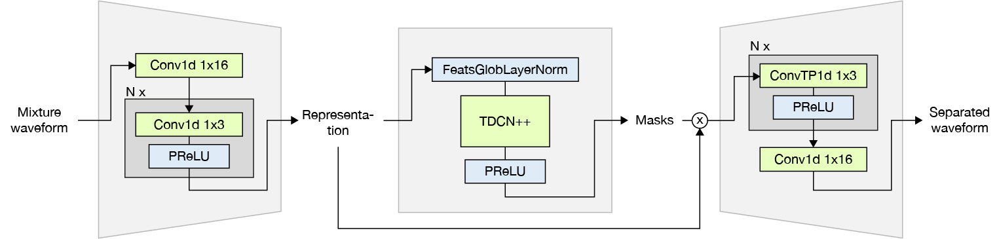

# Music Source Separation and (Re)Synthesis  

Combining music source separation with neural audio synthesis, i.e. apply a source separation model on a mixed musical track, and then use multiple audio synthesis models to resynthesise instrumental tracks.

The source separation models are adapted from [Conv-TasNet](https://github.com/JusperLee/Conv-TasNet) for music source separation. 
  

The (re)synthesis model uses the [RAVE](https://github.com/acids-ircam/RAVE/) pre-trained models from [acids-ircam](https://acids-ircam.github.io/rave_models_download) and the [Intelligent Instruments Lab](https://huggingface.co/Intelligent-Instruments-Lab/rave-models/tree/main). 